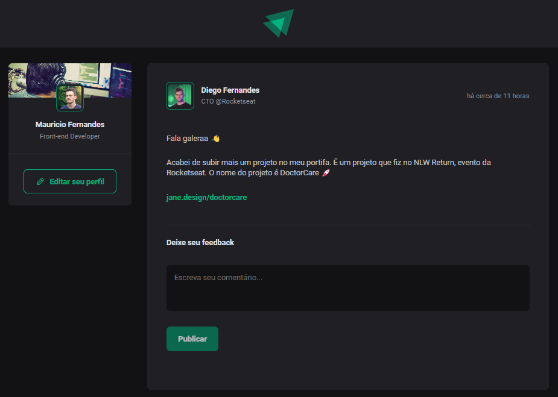

# Ignite Feed

Esta aplicação é um feed de postagens simples, com opções de comentar e reagir a comentários, criada para praticar os fundamentos do React e TypeScript.

<br>
<br>
## 🚀 Começando

Essas instruções permitirão que você obtenha uma cópia do projeto em operação na sua máquina local para fins de desenvolvimento e teste.


### 📋 Pré-requisitos


```
Node.JS instalado
```

### 🔧 Instalação

Primeiramente faça o download do projeto em sua máquina.

Instale as dependencias:

```
npm install
```

Para rodar a aplicação:

```
npm run dev
```

Após isso, siga o endereço informado no seu navegador, ex: http://localhost:5173/

<br>
<br>
## 🛠️ Construído com

* React
* TypeScript
* Vite
* Styled Components

<br>
<br>
---
⌨️ com ❤️ por [Mauricio Fernandes Tejada](https://github.com/mauricio-tejada) 😊